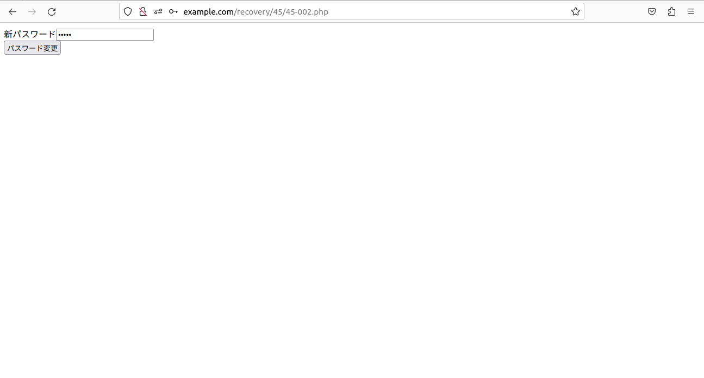

#  「重要な処理」の際に混入する脆弱性  

### [45-001](./45-001.php)  
  
### [45-002](./45-002.php)  
  
### [45-003](./45-003.php)  
  
### [45-900(CSRF)](45-900.html)  
  
### [45-004](./45-005.php)  
  
### [45-005](./45-005.php)  
  