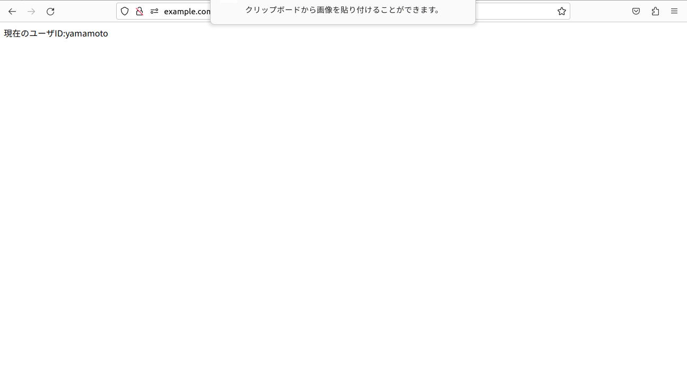

#  セッション管理の不備  
##  4章　６−２
[.user.ini](./462/user.ini)  
[46-900](./462/46-900.cgi)  
[462-001](./462/46-001.php)  
  
[462-002](./462/46-002.php)  
  
### ※462-001,002の結果画面はfirefoxの仕様が変更になりセッションID見れなく（漏れ対策）なっています  

##  ４章　６−３
### [463-010](./463/46-010.php)  
  
### [463-011](./463/46-011.php)  
  
### [463-012](./463/46-012.php)  
  
### [463-020](./463/46-020.php)  
  
### [463-021](./463/46-021.php)  
  
### [463-022](./463/46-022.php)  
    
### 463-020の引っかかった場合の画像  
  
